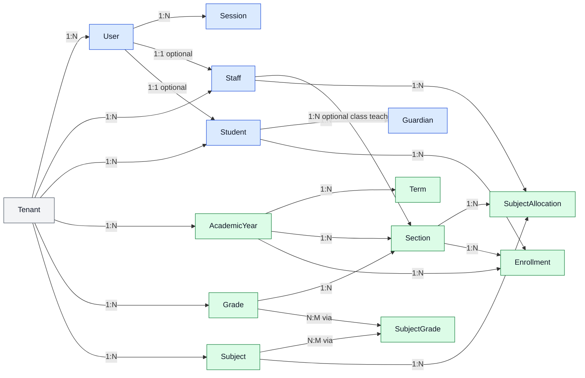
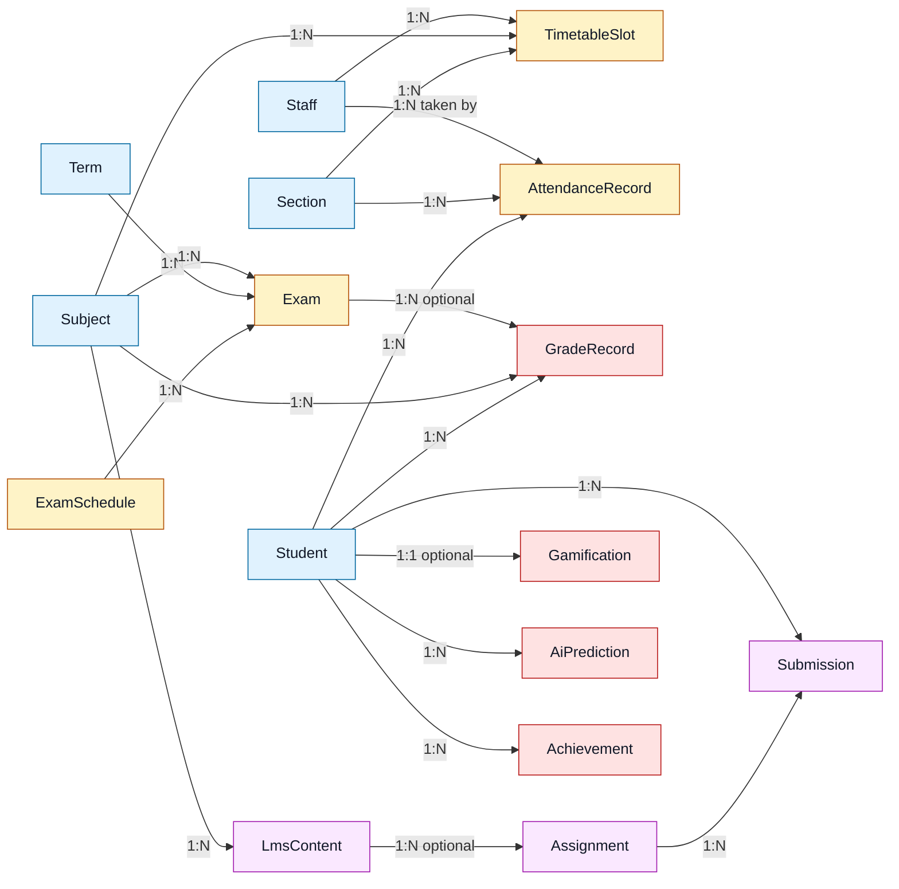
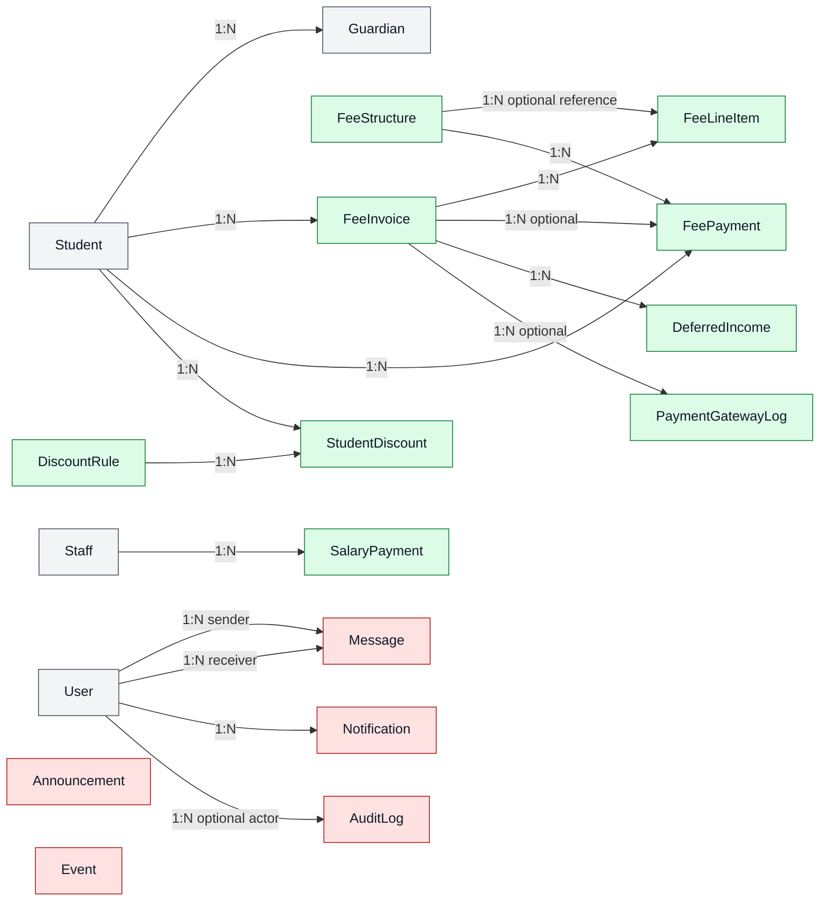
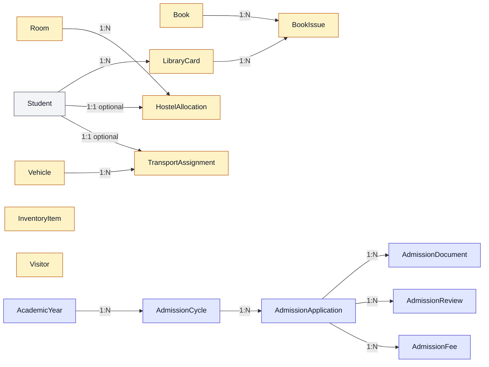

# Domain ERD

This is the same project model, split into smaller domain-focused diagrams for easier reading.

## 1. Identity, People, and Academic Structure

## 2. Teaching, Assessment, and Student Experience

## 3. Finance and Parent Operations

## 4. Campus Services and Admissions

## Notes

- Parent linkage is app-managed through `Guardian.userId`
- Admissions enrollment later creates `User`, `Student`, `Enrollment`, and `Guardian`
- Fee invoicing uses `FeeInvoice` as the ledger center
